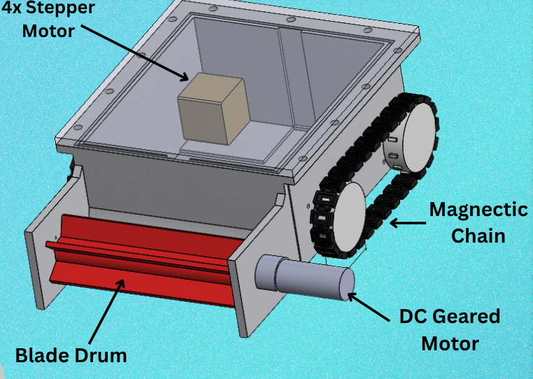

# Barnacle Cleaning Robot — HullVanguard

A tethered hull-climbing robot that removes barnacles from ship hulls, with a
desktop control station and on-board AI barnacle detection.

Built as an Integrated Design Project (KIG3011, Track 3, Group 36) at the
Faculty of Engineering, Universiti Malaya.



*Magnetic crawler tracks hold the 30 x 40 x 14 cm chassis to the hull while the
blade drum crushes barnacles at a controlled clearance, so the hull's
anti-fouling coating is never scraped.*

---

## What it does

A magnetic-wheeled chassis climbs the hull while a rotating brush drum scrubs
barnacles off the plating. An operator drives it from a laptop at the surface
over an RS485 tether, watching a live camera feed with a YOLO model outlining
barnacles in the frame.

| Subsystem | Implementation |
|---|---|
| Locomotion | Four NEMA stepper motors via TB6600 drivers, one per magnetic wheel |
| Cleaning | DC brush drum through an H-bridge |
| Tether link | RS485 differential pair (MAX485 at each end), 24 V power on the same tether |
| Control station | `HullVanguard` — Python/pygame GUI, Xbox controller or keyboard |
| Vision | ESP32-S3 camera, YOLOv8 barnacle detection |

---

## Architecture

```
TOPSIDE (surface)                          ONBOARD (in the ROV)
┌────────────────────────┐                ┌──────────────────────────────┐
│ Laptop — HullVanguard  │                │ ESP32_2  ── 4x TB6600 ── wheels
│   │ USB                │   RS485        │   │ I2C                       │
│   ├─ ESP32_1 ── MAX485 ├───tether───────┤ MAX485 ── ESP32_3 ── H-bridge ── drum
│   └─ ESP32-S3 (camera) │   + 24 V       │                              │
└────────────────────────┘                └──────────────────────────────┘
```

Frames on the tether are `0xAA 0x55 CMD LEN PAYLOAD CRC8`, with CRC8 over
`CMD + LEN + PAYLOAD` (polynomial `0x07`, init `0x00`). Commands are `DRIVE`
(signed left/right speed, -100..+100), `DRUM` (on/off) and `PING` (heartbeat).
See [`OnboardSteppers_ESP2/protocol.h`](OnboardSteppers_ESP2/protocol.h).

Full pin-by-pin wiring is in [`WIRING.md`](WIRING.md).

---

## Repository layout

```
Topside_ESP1/          Surface bridge — USB from laptop, RS485 to tether
OnboardSteppers_ESP2/  Stepper driver + protocol.h (shared frame definition)
OnboardDC_ESP3/        Brush drum H-bridge control
OnboardCam_S3/         ESP32-S3 camera streaming
GUI/                   HullVanguard control station (gui.py, build.py, installer)
AI/                    YOLO training script and dataset config
tests/                 Protocol frame/CRC unit tests
WIRING.md              Complete wiring reference
```

---

## Running the control station

Requires Python 3.11–3.14 on Windows.

```bash
pip install -r requirements.txt
python GUI/gui.py
```

Plug in both ESP32 boards and the Xbox controller *before* launching, then
press **Refresh** and pick the COM ports. Setup, controls and troubleshooting
are covered in [`GUI/README_install.md`](GUI/README_install.md).

If you have no NVIDIA GPU, install the CPU-only torch build first — see the
notes at the top of [`requirements.txt`](requirements.txt).

### Controls

| Action | Xbox | Keyboard |
|---|---|---|
| Left side forward / back | LT / LB | ↑ / ↓ |
| Right side forward / back | RT / RB | W / S |
| Drum on/off | A | Enter |
| E-STOP | B | Esc |

---

## Building the installer

```bash
python GUI/build.py
```

PyInstaller output lands in `GUI/dist/`, and the Inno Setup script
([`GUI/installer.iss`](GUI/installer.iss)) packages it into
`GUI/installer_output/`. None of that is committed — it is about 6.6 GB of
regenerated artefacts. Built installers are published as release assets
instead.

---

## Training the detector

```bash
cd AI
python train.py                      # yolov8s, 100 epochs, 960 px
python train.py --model yolov8m.pt   # larger model
python train.py --epochs 200
```

Weights land in `AI/runs/<name>/weights/best.pt`. The GUI looks for that file
to enable the **AI** button.

The dataset is **not** included in this repository. It is the
[barnacles dataset](https://universe.roboflow.com/stephen-7b2qu/barnacles-lnd34/dataset/1)
by `stephen-7b2qu` on Roboflow Universe, licensed **CC BY 4.0**. Download
version 1 in YOLOv8 format and extract it to `AI/barnacles_dataset/` so that
`train/`, `valid/` and `test/` sit beside the tracked `data.yaml`.

---

## Tests

```bash
python -m pytest tests/
```

Covers frame construction and CRC8 verification against the ESP32 protocol.

---

## Hardware

The boards were drawn in EasyEDA. Exports for each stage:

| Stage | Sheet |
|---|---|
| Power supply | [`docs/schematic-1-power-supply.png`](docs/schematic-1-power-supply.png) |
| Topside control | [`docs/schematic-2-topside-control.png`](docs/schematic-2-topside-control.png) |
| Onboard control | [`docs/schematic-3-onboard-control.png`](docs/schematic-3-onboard-control.png) |
| Motors | [`docs/schematic-4-motors.png`](docs/schematic-4-motors.png) |

The whole system on one sheet: [`docs/schematic-full.svg`](docs/schematic-full.svg).

Key parts: ESP32 controllers, NEMA 23 steppers on TB6600 drivers, JGB37-555
24 V DC motor for the drum on an IBT-4 43 A driver, MAX485 transceivers,
Mean Well LRS-350-24 supply, N35 neodymium magnets in the track segments, and
a 6 mm 316 stainless blade drum.

---

## Credits

KIG3011 Integrated Design Project 2, Track 3, Group 36 — Universiti Malaya.

The third-party barnacle dataset is credited above. Everything else in this
repository is the group's own work.

---

## Licence

MIT — see [LICENSE](LICENSE).

The third-party barnacle dataset is CC BY 4.0 and credited above; the MIT
licence covers this repository, not that dataset.
